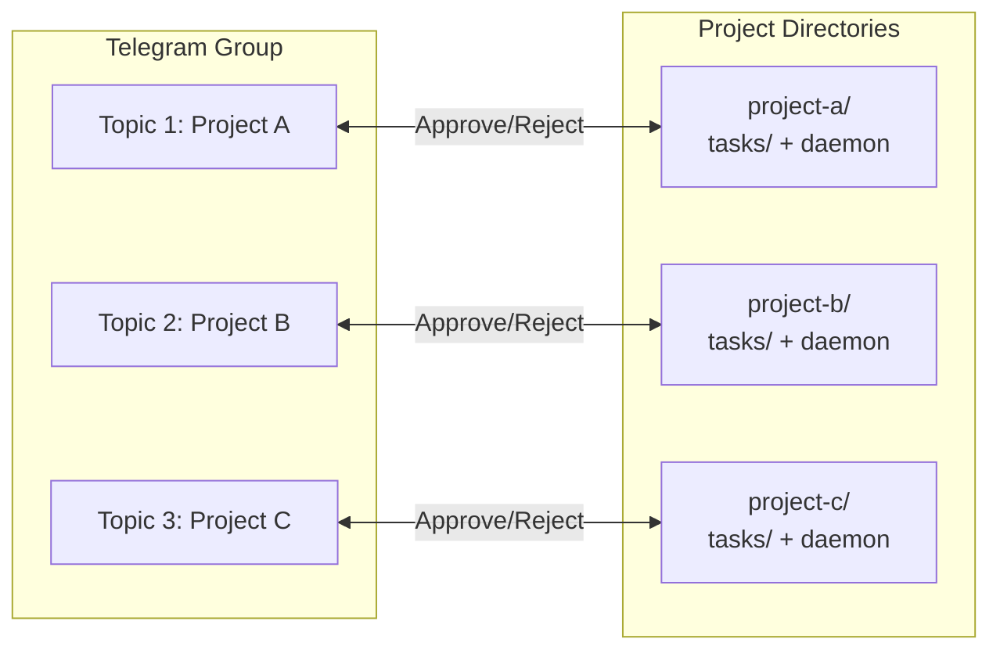

# Cognitive Loop Engine — Multi-Project Guide

## Overview

The Cognitive Loop Engine supports multiple projects through Telegram Topics. One bot, one group, multiple topics — each topic = one project.

```
Telegram Group: "Personal Projects"
├── Topic: "Cognitive Lead HQ"    → project A
├── Topic: "Mobile App"           → project B
└── Topic: "Backend API"          → project C
```

## How It Works

### Architecture

```
One Telegram Bot
    ↓
One Supergroup with Forum Topics
    ↓
Each Topic = One Project
    ↓
Each Project = One Daemon Instance
```

### Per-Project Setup

Each project needs its own:

| Component | Location | Purpose |
|---|---|---|
| `AGENTS.md` | Project root | Project-specific rules |
| `system-prompt.md` | Project root | Project-specific Brain |
| `opencode.json` | Project root | Project-specific Hands config |
| `tasks/` | Project root | Project-specific Kanban |
| `loop-engine/` | Project root | Project-specific daemon |
| `.env` | Project root | Project-specific API keys |
| `telegram-sync.json` | Project root | Project-specific Telegram config |

### Telegram Configuration

#### Project A: Cognitive Lead HQ

`telegram-sync.json`:
```json
{
  "config": {
    "project_name": "Cognitive Lead HQ",
    "chat_id": "123456789",
    "topic_id": 123,
    "target_hashtags": ["bug", "feature"]
  }
}
```

`loop-engine.jsonc`:
```json
{
  "approval": {
    "chat_id": 123456789
  }
}
```

#### Project B: Mobile App

`telegram-sync.json`:
```json
{
  "config": {
    "project_name": "Mobile App",
    "chat_id": "123456789",
    "topic_id": 456,
    "target_hashtags": ["bug", "feature"]
  }
}
```

`loop-engine.jsonc`:
```json
{
  "approval": {
    "chat_id": 123456789
  }
}
```

## Setup Steps

### 1. Create Telegram Supergroup

1. Create a new group in Telegram
2. Convert to Supergroup (Settings → Groups → Enable Topics)
3. Create topics for each project

### 2. Get Topic IDs

For each topic:
1. Open the topic
2. Copy the topic link (format: `https://t.me/c/123456789/123`)
3. The number at the end is the `topic_id` (e.g., `123`)

### 3. Configure Each Project

For each project directory:

```bash
# 1. Set up the project
cd /path/to/project
cp /path/to/cognitive-lead-hq/AGENTS.md ./
cp /path/to/cognitive-lead-hq/system-prompt.md ./
mkdir -p tasks/backlog tasks/in-progress tasks/qa tasks/completed tasks/archive
cp -r /path/to/cognitive-lead-hq/loop-engine ./

# 2. Create telegram-sync.json
cat > telegram-sync.json << 'EOF'
{
  "config": {
    "project_name": "My Project",
    "chat_id": "123456789",
    "topic_id": 123,
    "target_hashtags": ["bug", "feature"]
  },
  "last_processed_message_id": 0,
  "processed_ids": [],
  "sync_registry": {}
}
EOF

# 3. Configure loop-engine
cd loop-engine
source .venv/bin/activate
# Edit loop-engine.jsonc: set chat_id

# 4. Start daemon
python daemon.py
```

### 4. Run Multiple Daemons

Each project runs its own daemon:

```bash
# Terminal 1: Project A
cd /path/to/project-a/loop-engine
python daemon.py

# Terminal 2: Project B
cd /path/to/project-b/loop-engine
python daemon.py

# Terminal 3: Project C
cd /path/to/project-c/loop-engine
python daemon.py
```

Or use a process manager:

```bash
# Using systemd, supervisor, or pm2
# Each daemon is a separate service
```

## Workflow Per Project



## Limitations

| Limitation | Current State | Workaround |
|---|---|---|
| One bot token per .env | Each project has its own .env | Same token in all .env files |
| One chat_id per daemon | Each project has its own daemon | Same chat_id, different topic_id |
| No cross-project dependencies | Projects are isolated | Manual coordination |
| Daemon process per project | Each daemon is a separate process | Use process manager |

## Best Practices

1. **One Telegram Bot** — Use the same bot for all projects
2. **One Supergroup** — Create one group with forum topics enabled
3. **Topic per Project** — Each topic = one project's approval channel
4. **Isolated Dirs** — Each project has its own repo/directory
5. **Process Manager** — Use systemd/supervisor/pm2 for multiple daemons
6. **Shared .env** — Same API keys across all projects (copy .env)

## Example: 3 Projects

```
~/projects/
├── cognitive-lead-hq/          # Project A
│   ├── AGENTS.md
│   ├── tasks/
│   ├── loop-engine/
│   └── .env                    # TELEGRAM_CHAT_ID=123, TOPIC=123
├── mobile-app/                 # Project B
│   ├── AGENTS.md
│   ├── tasks/
│   ├── loop-engine/
│   └── .env                    # TELEGRAM_CHAT_ID=123, TOPIC=456
└── backend-api/                # Project C
    ├── AGENTS.md
    ├── tasks/
    ├── loop-engine/
    └── .env                    # TELEGRAM_CHAT_ID=123, TOPIC=789
```

All three share:
- Same Telegram Bot token
- Same Supergroup (chat_id)
- Different Topics (topic_id)
