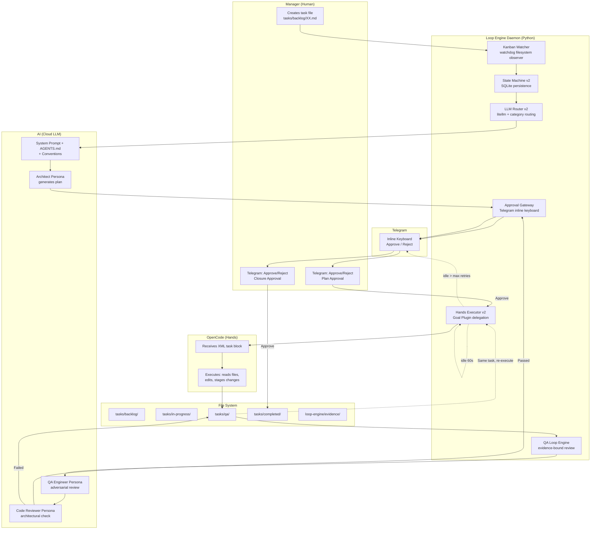

# Cognitive Loop Engine — Architecture Overview

The Cognitive Loop Engine is a local orchestration daemon that eliminates the manual copy-paste workflow between the Orchestrator (Brain) and OpenCode (Hands). It routes tasks to LLM APIs, invokes execution programmatically, and maintains Manager approval gates via Telegram.

## What It Does

```
Manager creates task → Daemon detects → AI plans → Telegram approval →
OpenCode executes → QA reviews → Telegram closure → Done
```

The Manager transitions from "data entry operator copying XML blocks" to "executive approving decisions via buttons."

## Architecture



## Components

| Component | File | Purpose |
|---|---|---|
| **Kanban Watcher** | `watcher.py` | Detects new `.md` files in `tasks/backlog/` via watchdog |
| **LLM Router** | `router.py` | Routes to optimal model via litellm (category-based) |
| **Approval Gateway** | `gateway.py` | Telegram inline keyboard for Manager sign-off |
| **Hands Executor** | `executor.py` | Runs OpenCode CLI, delegates auto-continue to Goal Plugin |
| **QA Loop Engine** | `qa_engine.py` | Evidence-bound review with trace sanitization |
| **State Machine** | `state.py` | SQLite-backed task state tracking |
| **Models** | `models.py` | Pydantic config validation |
| **Daemon** | `daemon.py` | Main entry point, orchestrates all components |

## Workflow

### 1. Task Creation
Manager creates a Markdown file in `tasks/backlog/`:
```bash
cat > tasks/backlog/01-add-login.md << 'EOF'
# Task 1: Add Login Feature
**File:** tasks/backlog/01-add-login.md
**Source:** manager
**Type:** feature
**Status:** open

## Goal
Add email/password login to the app

## Acceptance Criteria
- [ ] Login form renders
- [ ] API call works
- [ ] Redirect on success
EOF
```

### 2. Auto-Detection
Kanban Watcher detects the new file and registers it in SQLite state machine.

### 3. Planning
LLM Router sends task to AI with Architect persona. AI generates implementation plan.

### 4. Plan Approval
Gateway sends plan to Telegram with Approve/Reject buttons. Manager reviews and taps Approve.

### 5. Execution
Hands Executor runs OpenCode CLI. Goal Plugin handles auto-continue internally.

### 6. QA Review
QA Loop Engineer reviews code. If FAILED, feedback is written to the same task file and execution retries.

### 7. Closure
Gateway sends closure summary to Telegram. Manager approves. Task moves to `tasks/completed/`.

## Key Design Decisions

| Decision | Rationale |
|---|---|
| **QA failure stays in same task** | No task proliferation, single audit trail |
| **Goal Plugin for auto-continue** | More reliable than custom timeout (event-driven, re-entrancy guard, compaction survival) |
| **SQLite from day one** | OMO boulder-state validated this approach |
| **Category routing** | quick→kimi, deep→gpt-5.6, visual→opus-5 (inspired by OMO) |
| **ZAC intact** | Executor NEVER commits, only stages via MCP |
| **Evidence-bound QA** | No evidence = no commit (inspired by OMO) |

## Configuration

See [Configuration Reference](configuration.md) for all options.

## Setup

See [Setup Guide](setup.md) for installation instructions.

## Multi-Project Support

See [Multi-Project Guide](multi-project.md) for managing multiple projects with Telegram topics.
