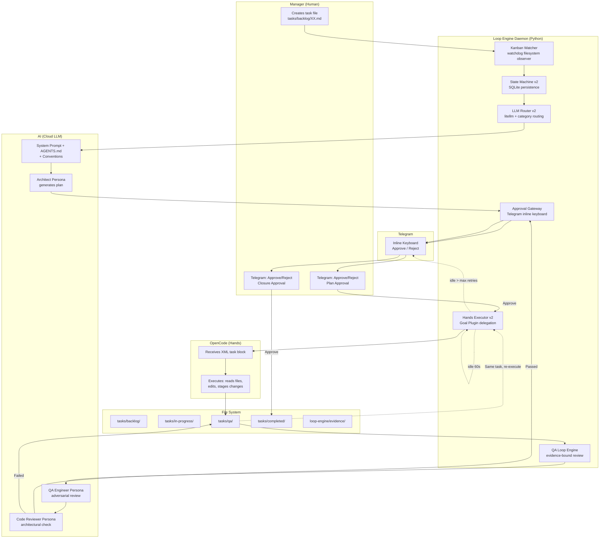

# Cognitive Loop Engine — Architecture Overview

The Cognitive Loop Engine is a local orchestration daemon that eliminates the manual copy-paste workflow between the Orchestrator (Brain) and OpenCode (Hands). It routes tasks to LLM APIs, invokes execution programmatically, and maintains Manager approval gates via Telegram.

## What It Does

```
Manager creates task → Daemon detects → [Trigger Gate] →
AI plans → Telegram approval → OpenCode executes →
QA reviews → Telegram closure → Done
```

The **Trigger Gate** decouples task creation from execution. Tasks register as `PENDING_TRIGGER` and wait for an explicit admin action (Telegram button or `/run` command) before entering the pipeline. This prevents auto-execution of incomplete or unedited task files.

The Manager transitions from "data entry operator copying XML blocks" to "executive approving decisions via buttons."

## Architecture



## Components

| Component | File | Purpose |
|---|---|---|
| **Kanban Watcher** | `watcher.py` | Detects new `.md` files in `tasks/backlog/` via watchdog |
| **LLM Router** | `router.py` | Routes to optimal model via litellm (category-based) |
| **Approval Gateway** | `gateway.py` | Telegram inline keyboard for Manager sign-off |
| **Hands Executor** | `executor.py` | Runs OpenCode CLI, delegates auto-continue to Goal Plugin |
| **QA Loop Engine** | `qa_engine.py` | Evidence-bound review with trace sanitization |
| **State Machine** | `state.py` | SQLite-backed task state tracking |
| **Models** | `models.py` | Pydantic config validation |
| **Daemon** | `daemon.py` | Main entry point, orchestrates all components |

## Workflow

### 1. Task Creation
Manager creates a Markdown file in `tasks/backlog/`:
```bash
cat > tasks/backlog/01-add-login.md << 'EOF'
# Task 1: Add Login Feature
**File:** tasks/backlog/01-add-login.md
**Source:** manager
**Type:** feature
**Status:** open

## Goal
Add email/password login to the app

## Acceptance Criteria
- [ ] Login form renders
- [ ] API call works
- [ ] Redirect on success
EOF
```

### 2. Detection & Trigger Gate
Kanban Watcher detects the new file. Based on `trigger_mode`:
- **`telegram_button` (default):** Task registers as `PENDING_TRIGGER`. Gateway sends a Telegram card with [🚀 Start Execution] / [⏸️ Hold] buttons.
- **`command_only`:** Task registers as `PENDING_TRIGGER`. Admin uses `/run <task_id>` to trigger.
- **`auto`:** Legacy behavior — task auto-enters the pipeline immediately.

### 3. Planning
LLM Router sends task to AI with Architect persona. AI generates implementation plan.

### 4. Plan Approval
Gateway sends plan to Telegram with Approve/Reject buttons. Manager reviews and taps Approve.

### 5. Execution
Hands Executor runs OpenCode CLI. Goal Plugin handles auto-continue internally.

### 6. QA Review
QA Loop Engineer reviews code. If FAILED, feedback is written to the same task file and execution retries.

### 7. Closure
Gateway sends closure summary to Telegram. Manager approves. Task moves to `tasks/completed/`.

## Key Design Decisions

| Decision | Rationale |
|---|---|
| **Trigger Gate decouples creation from execution** | Prevents auto-execution of incomplete tasks; admin reviews before triggering |
| **QA failure stays in same task** | No task proliferation, single audit trail |
| **Goal Plugin for auto-continue** | More reliable than custom timeout (event-driven, re-entrancy guard, compaction survival) |
| **SQLite from day one** | OMO boulder-state validated this approach |
| **Category routing** | quick→kimi, deep→gpt-5.6, visual→opus-5 (inspired by OMO) |
| **ZAC intact** | Executor NEVER commits, only stages via MCP |
| **Evidence-bound QA** | No evidence = no commit (inspired by OMO) |

## Configuration

See [Configuration Reference](configuration.md) for all options.

## Verification & Smoke Gate (Phase A Certified)

Phase A (Polyglot Toolchain & Execution Sandboxing) is certified by the end-to-end
smoke suite in `loop-engine/test_polyglot_smoke.py` — the **canonical verification gate**
for the loop engine. It drives the real pipeline components (`StateMachine`, `LLMRouter`,
`QAEngine`, `HandsExecutor`, `ApprovalGateway`, `LoopEngineDaemon`) anchored to an isolated
temporary workspace and proves:

- **Happy path (5 stacks):** Node-TS, Python-FastAPI, Kotlin-Android, Go-Gin, and the
  Generic fallback all progress through detection → plan → approval → preflight →
  execution → toolchain verification → QA → review → closure, ending `CLOSED`.
- **Hard fail-fast gates (7):** preflight failure crashes before execution; toolchain
  failure bypasses LLM QA and retries; `[goal:blocked: <reason>]` extraction crashes;
  empty diff crashes without toolchain/QA; retry recovery to `CLOSED`; max retries →
  `CRASHED`; explicit `**Stack:**` header overrides marker detection.
- **Supplementary (4):** plan rejection → `BACKLOG`; review rejection → `CRASHED`;
  QA-feedback retry recovery; daemon boot-scan registers `PENDING_TRIGGER`.

Run the gate:

```bash
uv run --project loop-engine --with pytest pytest loop-engine/test_polyglot_smoke.py -v
```

Full-suite certification bar (baseline 163 → ≥ 178 passing, 0 failures):

```bash
uv run --project loop-engine --with pytest pytest loop-engine/ -q
```

The suite is hermetic: every test builds its own workspace under `tmp_path`, patches
`daemon.REPO_ROOT` to that workspace, and sandboxes stack preflight/toolchain commands to
portable no-ops — so it passes on any CI machine without installed toolchains and never
touches the real repository.

## Verification & Smoke Gate (Phase B Certified — Contract-First Monorepo Governance)

Phase B (Contract-First Monorepo Governance & Shared Schema Propagation) is certified
by the end-to-end smoke suite in `loop-engine/test_contract_smoke.py` — the
**canonical Phase B verification gate** for contract governance. It extends the Phase A
hermetic pattern with a contract-centric monorepo (`packages/shared-schema`,
`services/api`, `apps/web`, `docs/adr`) and proves:

- **Contract mutation dispatch (2):** `packages/shared-schema/types.ts` mutation dispatches downstream tasks in `tasks/backlog/` with `**Triggered-By:** Task <id>` and sequential IDs registered as `BACKLOG` in SQLite; generated downstream task touching `apps/web/src/app.tsx` (non-schema) produces 0 cascades (no duplicate loop).
- **TypeDriftSentinel fail-fast (1):** manual `export interface UserDTO` in `apps/web/src/user.ts` fails `ToolchainRunner` gate before `qa.run_qa()`, triggers `_reimplement_task` retry.
- **Spec-First gating (2):** architecture keywords without ADR crash at Step 2.5 before `IMPLEMENTING`; verified ADR in `docs/adr/` passes and proceeds.
- **Blast-Radius scoping (1):** `apps/web` mutation runs verification for `apps/web` while unaffected `services/api` is skipped (per-workspace `Blast-radius scoping` note).
- **Full unified lifecycle (1):** Spec Gate → Clean Code → Sentinel Pass → Blast-Radius Scope → QA → Closure → Contract Propagation in one daemon run.
- **Non-contract no-propagation (1):** closing a task touching only application logic produces 0 downstream tasks.
- **Additional gates (6):** rule matching (`shared-schema`/`openapi`/`prisma`/`proto`), sentinel allowed patterns (`packages/shared-schema` DTOs pass), spec multiple-rule handling, blast root fallback (all affected), sequential ID generation, and SQLite `BACKLOG` registration.

Run the Phase B gate:

```bash
uv run --project loop-engine --with pytest pytest loop-engine/test_contract_smoke.py -v
```

Full-suite certification bar (baseline 271 → ≥ 285 passing, 0 failures):

```bash
uv run --project loop-engine --with pytest pytest loop-engine/ -q
```

Both smoke suites are hermetic: each test builds its own workspace under `tmp_path`, patches
`daemon.REPO_ROOT`, and uses scripted I/O seams (`call_llm`, `_run_once`, `request_approval`) —
so they pass on any CI machine without installed toolchains and never touch the real repository.

## Setup

See [Setup Guide](setup.md) for installation instructions.

## Multi-Project Support

See [Multi-Project Guide](multi-project.md) for managing multiple projects with Telegram topics.
