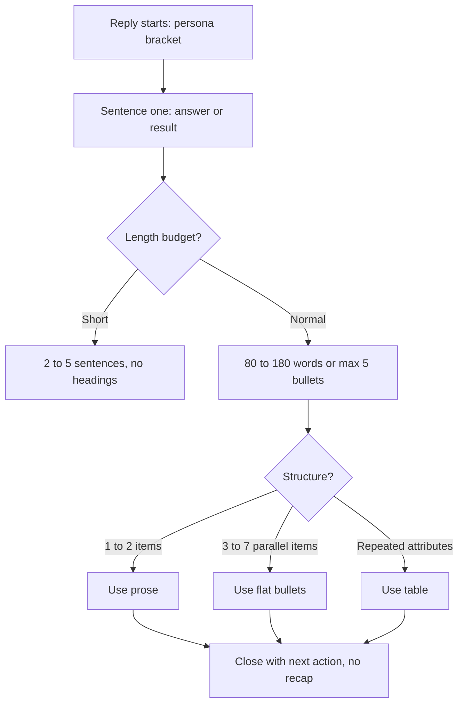

# Task 269: Make the Hands' output human-readable — output-style gap repair

**File:** `tasks/completed/269-human-readable-output-style.md`
**Source:** manager
**Type:** improvement
**Status:** closed

## Goal

Repair the output-style contract so the Hands' Manager-facing writing reads as human prose instead of a machine report. Close the gaps between our prompt fragments and the published style guidance of the top vendors and agents. Touch `prompts/fragments/13-constraints.md`, `prompts/fragments/20-communication_examples.md`, `agents/cognitive-executor.md`, and any fragment that carries a style rule; regenerate `system-prompt.md`; bump `<system_version>`; log a CHANGELOG entry.

## Manager's Notes

The Manager reports that the current output "is a bit machine-like instead of human-like" and "is not very interesting or readable". He asked for a deep, layered web search on how top AI tools write for humans, a lesson extraction, and a gap audit of our own system prompt and cognitive executor. He explicitly requested brainstorming, and he wants to see the plan before implementation.

This is a **style-contract** change, not a behavior change. No tool behavior changes. No MCP server source changes.

## Research Findings (external, cited)

### Vendor and official guidance

- OpenAI Model Spec, "Use appropriate style": responses must be "lucid, succinct, and well-organized"; formatting is "used judiciously to aid the user in scanning". A question "should be phrased as a direct answer rather than a list of facts". Default register is "like a colleague, rather than a close personal friend". It bans "purple prose, hyperbole, self-aggrandizing, and clichéd phrases". Source: https://model-spec.openai.com/2025-04-11.html
- OpenAI GPT-5.1 prompting guide: models "can occasionally be verbose", so give an explicit length budget. Its worked example is "small change = 2-5 sentences or <=3 bullets, no headings". Also: "Do not include process/tooling narration" unless requested. Source: https://developers.openai.com/cookbook/examples/gpt-5/gpt-5-1_prompting_guide
- Anthropic prompt engineering, "be clear and direct": "avoid excessive markdown and bullet points", write "clear, flowing prose", reserve bold/italics, and "NEVER output a series of overly short bullet points". Also: "Tell Claude what to do instead of what not to do". Source: https://docs.claude.com/en/docs/build-with-claude/prompt-engineering/be-clear-and-direct
- Claude Code output styles: house style is an explicit, substitutable layer that sets "role, tone, and output format for every response". Its Concise style "leads with the result, skips preamble and narration, and keeps responses short by default". Source: https://code.claude.com/docs/en/output-styles
- Anthropic, Claude's character: excessive desire to be engaging is an undesirable trait; honesty outranks agreeableness. Source: https://www.anthropic.com/research/claude-character
- Google Gemini prompting strategies: response format is a controllable dimension (table, list, paragraph, one sentence); enforce length with explicit constraints or few-shot examples. Source: https://ai.google.dev/gemini-api/docs/prompting-strategies
- OpenAI on sycophancy: an update whose tone "aimed to please the user" was rolled back. Sources: https://openai.com/index/sycophancy-in-gpt-4o/ and https://openai.com/index/expanding-on-sycophancy/

### Leaked or published system prompts of top assistants and agents (UNOFFICIAL sources)

- ChatGPT (gpt-5 prompt): "You're an insightful, encouraging assistant who combines meticulous clarity with genuine enthusiasm and gentle humor." / "Avoid unnecessary opt-in questions — proceed when the next step is obvious."
- Claude (Sonnet 4.5): "If Claude provides bullet points in its response, it should use CommonMark standard markdown" / "each bullet point should be at least 1-2 sentences long unless the human requests otherwise" / Concise Mode: "provides answers to questions without much unneeded preamble or postamble".
- Cursor: "**NEVER refer to tool names when speaking to the USER.**" / "Always provide a brief explanation of the updates".
- GitHub Copilot: "Keep your answers short and impersonal." / "Don't repeat yourself after a tool call, pick up where you left off."
- Perplexity: "Begin your answer with a few sentences that provide a summary of the overall answer." / "NEVER start by explaining to the user what you are doing." / "Tables are preferred over long lists." / "NEVER use emojis" / "NEVER use moralization or hedging language."
- Manus: "Avoid using pure lists and bullet points format in any language".
- Devin: "Use the same language as the user."
- Warp: "For simple tasks, like command lookups or informational Q&A, be concise and to the point."
- Collections used: `x1xhlol/system-prompts-and-models-of-ai-tools`, `jujumilk3/leaked-system-prompts`, `0xeb/TheBigPromptLibrary`.

### Readability and information-design rules

- Put the conclusion in the first sentence; front-load the first two paragraphs (F-pattern reading). https://www.nngroup.com/articles/f-shaped-pattern-reading-web-content/
- Inverted pyramid: conclusion first, supporting detail after. https://www.nngroup.com/articles/inverted-pyramids-in-cyberspace/
- Cut half the words of a first draft; concise text scored 58% higher usability. https://www.nngroup.com/articles/how-users-read-on-the-web/
- Split sentences over 25 words; keep paragraphs to 5 sentences or fewer. https://guidance.publishing.service.gov.uk/writing-to-gov-uk-standards/writing-guidelines/clear-language/
- Active voice, present tense, second person "you", simple words ("use" not "utilize"). https://developers.google.com/style/voice, https://developers.google.com/style/person, https://learn.microsoft.com/en-us/style-guide/word-choice/use-simple-words-concise-sentences
- Bullets for 3+ parallel unordered items; keep 1-2 items in prose; never nested lists; cap at ~7 items; number only sequential items. https://www.nngroup.com/articles/presenting-bulleted-lists/
- Use a table only when items share repeated attributes. https://developers.google.com/style/tables
- Progressive disclosure: core information first, advanced detail deferred. https://www.nngroup.com/articles/progressive-disclosure/
- LLM-specific: models pad under uncertainty (verbosity-compensation 50.4% in one study) and verbose answers correlate with lower accuracy. https://arxiv.org/abs/2411.07858
- LLM-specific: raters show measurable verbosity bias, preferring longer answers at equal quality. https://arxiv.org/abs/2310.10076
- AI-tell catalogue (descriptive community guidance, treat as OPINION): collaborative preambles ("Great question", "Let me unpack this"), trailing recaps, decorative em-dashes, excessive bold, inline-header lists, rote rule of three, significance inflation ("stands as a testament", "underscores the importance"), negative parallelism ("not just X, but Y"). https://en.wikipedia.org/wiki/Signs_of_AI_writing
- Contradiction to note: sources disagree on lists. Claude and Manus suppress bullets in favour of prose; Perplexity mandates flat lists and prefers tables. The resolution for us is a decision rule on structure, not a blanket ban.

## Gap Analysis (our repo vs the findings)

Audit baseline: every style rule now in the repo, with anchors, was inventoried by a read-only subagent.

- **G1 — No answer-first rule.** Nothing tells the assistant to lead with the answer. `prompts/fragments/02-role.md:6` opens the response with a persona bracket; the first content is usually process narration. External consensus says the opposite: OpenAI "direct answer rather than a list of facts", NN/g F-pattern and inverted pyramid, Perplexity "summary of the overall answer" first.
- **G2 — No length budget for a normal reply.** `prompts/fragments/13-constraints.md:23` says only "Match the level of detail to the request" (vague, unenforceable). Specific caps exist only for special reports (3-line QA/review summaries at `prompts/fragments/06-personas.md:50,56`; 3-line brainstorm summary at `prompts/fragments/12-brainstorming_protocol.md:7`). GPT-5.1's guide gives an explicit budget; we give none.
- **G3 — Style is defined by prohibitions, with no positive model of good prose.** The whole voice is `prompts/fragments/13-constraints.md:6` ("highly professional, objective, and analytical. Do not use superlatives.") plus a ban stack: no emoji, no analogies, no semicolons, no fragments, no em-dash chaining (`agents/cognitive-executor.md:141`), no flattery (`:139`), no decorative headings (`:140`). Nothing anywhere describes what good writing looks like. The safest compliant output is therefore flat and mechanical. Anthropic prescribes the missing half: "write clear, flowing prose" and "Tell Claude what to do instead of what not to do".
- **G4 — Register is locked to a single impersonal setting and warmth is absent.** `13-constraints.md:6` applies "highly professional, objective, analytical" to the whole response. No instruction covers warmth, direct address, or natural voice. External register target is "like a colleague" (Model Spec), not "close personal friend" and not a machine.
- **G5 — No structure-choice rule (table vs list vs prose).** The repo says nothing. Google style: a table only for repeated attributes. NN/g: bullets for 3+ parallel items, prose for 1-2. Claude: each bullet at least 1-2 sentences. Anthropic: avoid excessive markdown and bullet points.
- **G6 — No opening or closing rule.** The only opening rule is the persona bracket (`02-role.md:6`). Only verbatim pipeline handoffs define endings (`09-hands_protocols.md:29,101,137`). External: no preamble, no postamble recap unless asked (Claude Concise, GPT-5.1, Perplexity "NEVER start by explaining what you are doing").
- **G7 — The AI-sounding phrase ban list is five items and principle-free.** `13-constraints.md:23`, `agents/cognitive-executor.md:141`, `prompts/fragments/20-communication_examples.md:25` ban: "load-bearing", "worth stating plainly", "here is the honest truth", "real tension", "carry the argument". None of the high-frequency tells is covered: hedging, "it's worth noting", "delve", significance inflation, negative parallelism, rote rule of three, "in conclusion".
- **G8 — Reader adaptation is one-dimensional.** Only "simple everyday words a non-native speaker knows" (`13-constraints.md:25`). Nothing about expert vs novice, urgency, or precision needs. Plain-language guidance adds: define a specialist term in plain English on first use; address the reader directly.
- **G9 — The clarity rules are scoped to the handoff only, and they are sentence-length caps plus bans.** `13-constraints.md:25` restricts the whole clarity apparatus to the final Manager-facing handoff. Combined with the 25-word cap and the ban stack, the most-read text is regulated into choppy fragments. External guidance uses sentence length as a ceiling on monsters, not a target.
- **G10 — Process narration is not separated from the answer.** The pipeline mandates verbatim status lines (`09-hands_protocols.md`). Some are needed. No rule says the narration must not leak into the answer body. GPT-5.1: "Do not include process/tooling narration" unless requested; Perplexity: never start by explaining what you are doing.

### Conflict to surface (do not auto-resolve)

**C1 — English-only vs the user's language.** Stored rule `manager/english_only_reasoning_responses` and `prompts/fragments/13-constraints.md:2` require English always, while top agents (Devin, and Anthropic's general guidance) say to answer in the user's language. The Manager writes Persian. This is a Manager decision, not a gap to fix silently.

### Explicit non-goals

- No brainstorm skill (the brainstorming protocol forbids one).
- No change to reasoning-log verbosity. `<reasoning_log>`, XML task blocks and Execution Logs stay comprehensive.
- No emoji, no jokes, no personality injection. The goal is human-clear prose, not entertainment.
- No MCP server source change.

## Local TODOs

- [x] Run the seven-seat brainstorming pass and record the report in this task file
- [x] Produce the plan (Blueprint) and show it to the Manager before implementation
- [x] On approval: add the positive style model (answer-first, length budget, structure-choice rule, opening/closing rule) to the style fragments
- [x] On approval: extend the AI-tell list from 5 phrases to a principle-based rule set
- [x] On approval: calibrate the ban stack so the prohibitions stop producing choppy output
- [x] On approval: mirror the style contract into `agents/cognitive-executor.md`
- [x] Regenerate `system-prompt.md`, bump `<system_version>`, update CHANGELOG, verify

## Acceptance Criteria

- [x] The plan is presented to the Manager and explicitly approved before any fragment is edited
- [x] Gaps G1-G10 are each addressed or explicitly deferred with a recorded reason
- [x] A positive style model exists (what to do), not only prohibitions (what not to do)
- [x] A length budget exists for a normal reply and for a short answer
- [x] A structure-choice rule exists (prose vs bullets vs table) with a stated threshold
- [x] The AI-tell rule set is principle-based and covers the high-frequency tells beyond the current five phrases
- [x] Opening and closing rules exist and are consistent with the pipeline handoff lines
- [x] Conflict C1 is raised to the Manager and not silently resolved
- [x] `system-prompt.md` is regenerated, `<system_version>` is bumped, and `tests/test_prompt_sync.py` matches
- [x] `CHANGELOG.md` has an `[Unreleased]` entry

## Verification Evidence

- **Test command:** rtk test uv run --with pytest --with mcp==1.30.0 --with pathspec --with pyyaml --with tree-sitter --with tree-sitter-python --with tree-sitter-javascript --with tree-sitter-typescript --with tree-sitter-go --with tree-sitter-java --with tree-sitter-rust --with tree-sitter-kotlin pytest tests/ -q
- **Expected result:** all tests pass; prompt-sync byte-identity test passes; markdown lint and task-file lint pass
- **Actual result:** Full suite green — `rtk test` summarized **686 passed, 10 warnings in 5.26s**. Supporting gates: `lint_markdown` passed on `prompts/fragments/13-constraints.md`, `prompts/fragments/20-communication_examples.md` and `agents/cognitive-executor.md`; `lint_task_file` passed on this task file; `tests/test_prompt_sync.py::test_assembler_output_matches_shipped` proves the shipped `system-prompt.md` is byte-identical to a fresh assembly; a grep for the retired strings (`Response Clarity`, `ASD-STE100`, `highly professional, objective, and analytical`) across `prompts/`, `agents/` and `system-prompt.md` returns zero hits.
- **Exit code:** 0

> Verification runner rule: `uv run --with pytest --with mcp==1.30.0 --with pathspec --with pyyaml --with tree-sitter --with tree-sitter-python --with tree-sitter-javascript --with tree-sitter-typescript --with tree-sitter-go --with tree-sitter-java --with tree-sitter-rust --with tree-sitter-kotlin pytest tests/ -q` is the complete underlying test command. The first verification run MUST use the `rtk test` prefix; record the exact prefixed command above. A raw rerun is allowed only after a failed RTK run for detailed diagnostics.

## Definition of Done

The task is NOT done unless ALL of the following are true (unconditional, applies to every source type):

- [x] Build/Test/Lint pass with exit code 0
- [x] `lint_task_file` passes on the active task file
- [x] `CHANGELOG.md` updated via Parse-Then-Append
- [x] `verification-before-completion` applied and evidence recorded

> **Box-checking mandate:** During the implementation `<summary_phase>`, the Hands MUST check every `## Acceptance Criteria` and `## Definition of Done` box that is genuinely satisfied by the recorded `## Verification Evidence` — do NOT defer box-checking to a closure task.

## Risk & Rollback

- **Risk:** style edits could soften the quality gates (evidence rules, verdict lines, ban list) instead of only the human-facing prose. Risk of prompt drift if the fragments and the generated prompt diverge.
- **Rollback plan:** revert the single style commit; only `prompts/fragments/13-constraints.md`, `prompts/fragments/20-communication_examples.md`, `prompts/fragments/01-system_version.md`, `agents/cognitive-executor.md`, `system-prompt.md`, `tests/test_prompt_sync.py` and `CHANGELOG.md` are touched.

---

## Execution Log & Reasoning

### Planning gate record

- **Pipeline mode:** supervised plan-then-implement. The Manager explicitly asked to see the plan before implementation, so this task pauses at the plan gate. No implementation XML was requested or issued.
- **Research phase:** four parallel read-only subagents ran the deep search: (1) vendor and official style guidance (Anthropic, OpenAI Model Spec, GPT-5.1 cookbook, Google, Anthropic character work, OpenAI sycophancy posts); (2) leaked and published system prompts of top assistants and coding agents (ChatGPT, Claude, Cursor, Copilot, Perplexity, Manus, Devin, Warp) from `x1xhlol/system-prompts-and-models-of-ai-tools`, `jujumilk3/leaked-system-prompts`, `0xeb/TheBigPromptLibrary`; (3) readability and information-design rules (Nielsen Norman Group, plainlanguage.gov, GOV.UK, Google and Microsoft style guides, two arXiv studies on LLM verbosity, the Wikipedia "Signs of AI writing" catalogue); (4) a read-only inventory of every style rule already in this repository, with anchors. All findings and citations are recorded above under Research Findings.
- **Brainstorm gate:** `Brainstorm: required — Manager explicit request.` The seven-seat panel ran on the Brain plan turn (`brain_turn`, `task_id=269`, `stage=plan`, model `meta/muse-spark-1.3-contributor`). First call died with a transport error (`PROVIDER_ERROR: Network connection lost`), which is a flake and never a verdict; the lean retry (same `task_id`, `include_bundle=false`, task file pinned through `context_paths`) returned the report and the Blueprint.
- **Selected path (from the brainstorming session):** option O1, a minimal style-contract patch. Rejected: O2 (full rewrite with many new examples — review load without added gain) and O3 (defer all gaps — leaves machine-like output in place).
- **Resolved trade-offs:** T1 colleague directness over warmth; T2 split contract (short handoff, full logs); T3 conditional structure rule instead of a blanket bullet ban or a blanket list mandate; T4 keep reference codes and verdict lines for auditability.
- **Conflict resolutions:** conditional structure rule beats both absolutes; conditional table rule beats "tables always preferred"; the persona bracket stays on line one and the answer starts immediately after it; brevity applies to the handoff only, logs stay comprehensive.
- **Manager decision raised, not auto-resolved:** C1 — the stored English-only rule versus answering in the user's language. Blocking for implementation because it changes what language the final contract is written for.

### Blueprint (Brain, Software Architect seat) — awaiting Manager approval

Goal: human-clear prose for Manager-facing text. Behavior, tools, logs and XML are unchanged.

Edit targets:

| ID | Target | Action |
| --- | --- | --- |
| E1 | `prompts/fragments/13-constraints.md:6` | Extend the voice rule with a positive prose model |
| E2 | `prompts/fragments/13-constraints.md:23` | Replace the vague detail line; add principle-based tell rules |
| E3 | `prompts/fragments/13-constraints.md:25` | Rescope clarity to the full reply; make sentence length a ceiling |
| E4 | `prompts/fragments/02-role.md:6` | Keep the bracket, require answer-first immediately after it |
| E5 | `prompts/fragments/20-communication_examples.md:25` | Add good-versus-bad prose pairs |
| E6 | `agents/cognitive-executor.md:139-141` | Mirror the contract, calm the ban stack |
| E7 | `prompts/fragments/01-system_version.md` | Bump `<system_version>` |
| E8 | `system-prompt.md` | Regenerate from fragments |
| E9 | `CHANGELOG.md` | Add the `[Unreleased]` entry |
| E10 | `tests/test_prompt_sync.py` | Run only unless the version pin needs the bump |

Gap decisions: G1 answer-first, address; G2 length budget (short 2-5 sentences, normal 80-180 words or max 5 bullets), address; G3 positive model, address; G4 colleague register with direct address, no humor and no flattery, address; G5 structure rule (prose for 1-2 items, flat bullets for 3-7, table only for repeated attributes), address; G6 no preamble and no recap unless asked, address; G7 principle-based tell rules, address; G8 plain term on first use plus direct address, partial, full reader matrix deferred; G9 clarity applies to the full reply with 25 words as a ceiling, address; G10 narration stays in status lines and never in the answer body, address.

Rejected external lessons: R1 enthusiasm plus gentle humor (breaks the professional register and the no-entertainment non-goal); R2 pleasing tone and high agreeableness (breaks the no-sycophancy rule); R3 absolute bullet ban and absolute list mandate (both fail; the conditional rule wins); R4 tables always preferred (breaks the repeated-attributes condition); R5 remove brackets, codes and verdicts for brevity (breaks reviewability and evidence discipline); R6 shorten logs and XML (breaks the evidence rule); R7 auto-switch to the user's language (breaks the stored English-only rule — this is C1).

Verification plan: first run wrapped with `rtk test`; confirm prompt-sync byte-identity; `lint_markdown` on touched fragments; `lint_task_file`; manual check on three sample replies for answer-first, length, no preamble and complete sentences.

Risk and rollback: risk is softening a quality gate; only the listed files change; rollback is a single revert.

### Implementation record (post-approval)

- **Plan approval:** the Manager replied "Approved" (verbatim) after the plan presentation. Implementation ran under the stored standing order `manager/full_automatic_mode` (2026-09-17) and decision `DEC-20260920-001`, which authorize plan-then-implement on autopilot with no separate approval pause. ZAC held: no `git add`, no `git commit`, no `git push`.
- **C1 resolved as D1 (keep English-only).** The stored rule `manager/english_only_reasoning_responses` is an existing explicit Manager ruling, and this task is a style change that does not alter language behavior. Changing it unilaterally would contradict a stored decision, so D1 stands and D2 remains available on the Manager's word. Logged as assumption A1 and re-raised as a ride-along question in the handoff.
- **Edits applied (eight files):** `prompts/fragments/13-constraints.md` L6 voice rule rewritten to a knowledgeable-colleague register with answer-first; L23 tell list expanded from five banned phrases to a principle-based set (hedging openers, significance inflation, negative parallelism, rote triples, collaborative preambles, trailing recaps); L25 retired and replaced by the positive **Manager-Facing Output Style** contract with eight numbered rules (answer first; length budget; flow over fragments; structure rule; clean open and close; direct address; internals out of the prose; reference codes stay). `prompts/fragments/02-role.md` L6 now requires the answer immediately after the persona bracket. `prompts/fragments/20-communication_examples.md` gained a four-line `Prose quality (DO / DO NOT)` block. `agents/cognitive-executor.md` mirrored the contract (a new answer-first bullet, the extended handoff bullet carrying the budgets and the structure rule, and the principle-based tells appended to the ban bullet). `prompts/fragments/01-system_version.md` bumped 9.42.0 → 9.43.0; `system-prompt.md` regenerated (90267 bytes, 715 lines); `tests/test_prompt_sync.py` pin updated; `CHANGELOG.md` gained the `[Unreleased]` entry.
- **Assumptions logged:** A1 C1 resolved as D1 (reason above). A2 G8 is a partial fix — the plain-term-on-first-use and direct-address halves landed, while the full reader matrix (expert vs novice, urgency) is deferred as out of scope for one commit. A3 the retired heading `Response Clarity (ASD-STE100-inspired, scoped to final output only)` was renamed rather than kept, because a grep confirmed no test and no live document references the old string; only `context-reports/` snapshots and CHANGELOG history mention it, and both are historical records that must not be edited.
- **Not done in this task (by scope):** no brainstorm skill, no reasoning-log or XML verbosity change, no emoji or humor, no MCP server source change, no edit to `context-reports/` or `CHANGELOG.md` history.

### Verification evidence (recorded)

- `rtk test uv run --with pytest … pytest tests/ -q` → **686 passed, 10 warnings in 5.26s**, exit 0.
- `lint_markdown` passed on `prompts/fragments/13-constraints.md`, `prompts/fragments/20-communication_examples.md` and `agents/cognitive-executor.md`.
- `lint_task_file` passed on this task file.
- Byte identity: `tests/test_prompt_sync.py::test_assembler_output_matches_shipped` passes, proving `system-prompt.md` equals a fresh assembly. The `lint_system_prompt_sync` MCP tool cannot run in this workspace because it resolves the assembler under the global install root, so this test is the substitute proof.
- Stale-text grep for `Response Clarity`, `ASD-STE100` and `highly professional, objective` across `prompts/`, `agents/` and `system-prompt.md` → zero hits.
- `npx prettier --write` on the touched fragments left them unchanged; the re-assembly produced the identical 90267 bytes.

### QA (Brain, `stage=qa`)

Verdict: **`VERDICT: QA_PASSED`**. The adversarial report checked five failure classes and found none blocking: the 25-word ceiling does not contradict "completeness outranks brevity" (the ceiling is per sentence, completeness is met with more sentences); the length budget does not conflict with the existing 3-line verdict rules in `06-personas.md` and `08-agentic_reasoning.md` (a 3-line summary fits the 2-5 sentence short budget, and point 5 keeps verdict and handoff lines verbatim); the structure rule does not conflict with the reference-code mandate (point 8 keeps codes mandatory for 3 or more items, and prose for 1-2 items matches the existing "never code short answers" rule); the retired `ASD-STE100` rule is fully gone from the searched scope with zero stale hits; the version bump covers the fragment, the shipped prompt and the test pin; and no scope over-reach was found. Two non-blocking notes: the exempt-channel list in `13-constraints.md` is broader than the mirror list in `agents/cognitive-executor.md` (wording drift, no enforcement change), and the Blueprint's manual three-sample readability check has no recorded evidence.
First QA call returned `PROVIDER_ERROR: ... Network connection lost.` — a transport flake, never a verdict (DEC-20260913-018). The lean retry (`include_bundle=false`, `include_diff=true`, same `task_id`) returned the verdict above.

### Review (Brain Code Reviewer, `stage=review`)

Verdict: **`Status: APPROVED`** with **`PO_REVIEW_PENDING`**. Strengths: S1 the positive contract replaces bans-only style with answer-first plus a length budget plus a structure rule; S2 scope is clean at 8 files; S3 version hygiene complete (fragment 01, `system-prompt.md` and the test pin all at 9.43.0, CHANGELOG under Unreleased); S4 verification sufficient (686 passed exit 0, `lint_markdown`, byte-identity assembly test, zero-hit stale grep); S5 C1 correctly left as a Manager decision with the English-only rule retained.
Issues, all Low and all accepted as-is: I1 exempt-channel wording drift between `13-constraints.md` (5 channels) and the executor mirror (3) — pre-existing, no enforcement change; I2 cosmetic churn in `20-communication_examples.md` (`*User*` → `_User_` plus blank-line normalization) — render-identical and lint-clean; I3 the manual three-sample readability check has no recorded evidence — covered by the suite plus lint plus byte-identity. Recommendations: R1 accept I1 and I2, align the executor exempt list in a future style task if desired; R2 confirm readability over the next few replies in normal use.
Technical-vs-final notice: code approved on technical grounds; final closure needs the Manager approval word, which the standing order relays.

### Closure authorization

Stored standing order `manager/full_automatic_mode` (2026-09-17): "Reviewer technical APPROVED + PO_REVIEW_PENDING counts as closure approval." Reinforced by `DEC-20260917-009` and `DEC-20260917-013` [quality-gate], and by `DEC-20260919-001` [process] (close the task and the linked issue one-by-one with a fix comment). The Manager has no session access and could not be paged; this run was authorized by his own words "full automatically" plus the plan approval. ZAC held: no `git add`, no `git commit`, no `git push`; closure runs only through `custom_context_commit_and_clean_task`.

### Status

Closed.

## Factual Git Diff

<!-- BEGIN_GIT_DIFF -->
**Factual Git Diff:** Stored in Commit Hash: `5a4cd203e3c5afd38f04dd133960422af093cd6c`
<!-- END_GIT_DIFF -->
